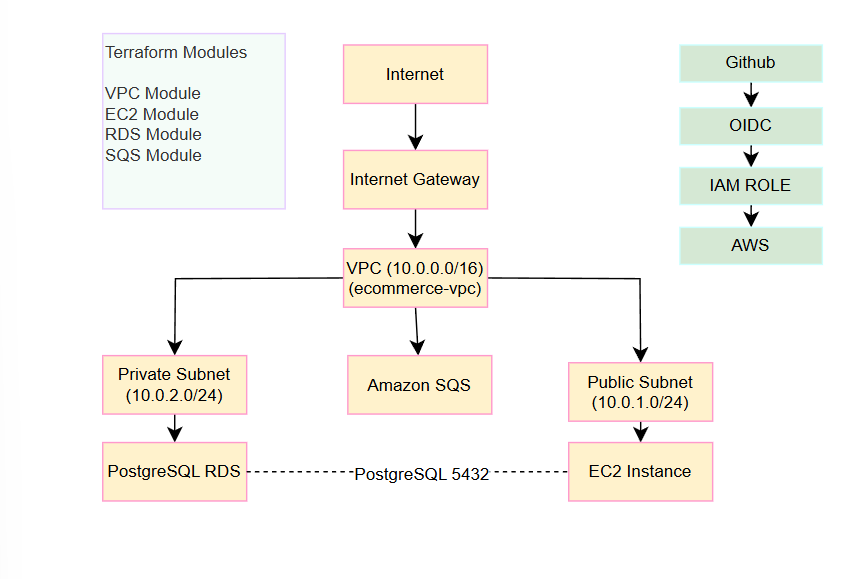

# Architecture

## System Overview

This project implements a cloud-native Mini E-Commerce platform using AWS infrastructure and three microservices communicating via REST and asynchronous messaging (SQS).

## Application Services

| Service | Port | Responsibility |
|---|---|---|
| **catalog-service** | 8082 | Product catalog management (CRUD) |
| **order-service** | 8083 | Order management, SQS producer |
| **notification-service** | 8084 | SQS consumer, order notifications |

## Communication Flow

```
Client
  │
  ▼
catalog-service ──── PostgreSQL (RDS) [private subnet]
  
Client
  │
  ▼
order-service ──── PostgreSQL (RDS) [private subnet]
  │
  ├── OpenFeign ──► catalog-service (validate product + reduce stock)
  │
  └── SQS ──► notification-service (order created event)
```

## Infrastructure Components

| Component | Details |
|---|---|
| **VPC** | 10.0.0.0/16 |
| **Public Subnet** | 10.0.1.0/24 — EC2 instances |
| **Private Subnet** | 10.0.2.0/24 — RDS database |
| **EC2 Instance** | Hosts Docker containers |
| **RDS PostgreSQL** | Persistent storage for catalog and order data |
| **SQS Queue** | Async communication between order and notification services |
| **Internet Gateway** | Public internet access |
| **GitHub OIDC** | Keyless AWS authentication for CI/CD |

## Security Design

- RDS is in a **private subnet** — not accessible from the internet
- EC2 Security Group allows only ports 22 (SSH), 8082, 8083, 8084
- RDS Security Group allows port 5432 only from EC2 Security Group
- GitHub Actions authenticates with AWS via **OIDC** — no hardcoded credentials

## Infrastructure Diagram



## CI/CD Flow

```
git push → GitHub Actions CI
  │
  ├── Build Docker image (catalog, order, notification)
  └── Push to GHCR (ghcr.io)
        │
        ▼
     GitHub Actions CD
        │
        ├── Authenticate with AWS via OIDC
        └── Run Ansible playbook
              │
              ├── Install Docker on EC2
              └── Pull and run containers
```
